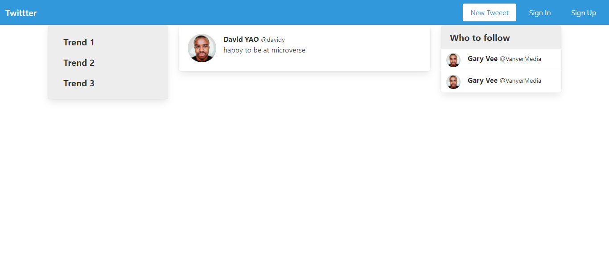

# members-only
In this project, we built a twitter clone with Rails 6.

## Project screenshot

## 🔨 Built in

- Ruby on Rails 6.0.3

## 🚀 Our Project

Our project can be found at https://github.com/daviidy/demo_twitter_rails

## Live Demo

You can find the demo [here](https://stark-oasis-91504.herokuapp.com/)

## Gems used

- [devise](https://rubygems.org/gems/devise)
- [gravatar_image_tag](https://rubygems.org/gems/gravatar_image_tag)
- [better_errors](https://rubygems.org/gems/better_errors)
- [guard](https://rubygems.org/gems/guard)
- [guard-livereload](https://rubygems.org/gems/guard-livereload)
- [bulma-rails](https://rubygems.org/gems/bulma-rails)
- [simple_form](https://rubygems.org/gems/simple_form)

## To run the project in local

- clone the repository from here [repo link](https://github.com/daviidy/demo_twitter_rails)
- Open terminal and navigate to root folder (/demo_twitter_rails).
- Once in root folder
  - type: `rails s` in terminal and in browser
  - run `bundle install`, `rails db:create`, and `rails db:migrate`
  - type localhost:3000/ in address bar.

## 👨🏽‍💻 👨🏿‍💻 Creators

👤 **Daviidy**

- Github: [@daviidy](https://github.com/daviidy)

## 🤝 Contributing

Contributions, issues and feature requests are welcome!

Feel free to check the [issues page](https://github.com/daviidy/Micro-Reddit/issues).

## Show your support

Give a ⭐️ if you like this project!

## 📝 License

This project is no licensed.
